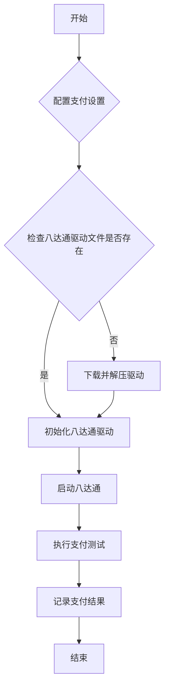

```mermaid
graph TD
    A[开始] --> B{配置支付设置};
    B --> C{检查八达通驱动文件是否存在};
    C -- 是 --> D[初始化八达通驱动];
    D --> E[启动八达通];
    C -- 否 --> F[下载并解压驱动];
    F --> D;
    E --> G[执行支付测试];
    G --> H[记录支付结果];
    H --> I[结束];
```