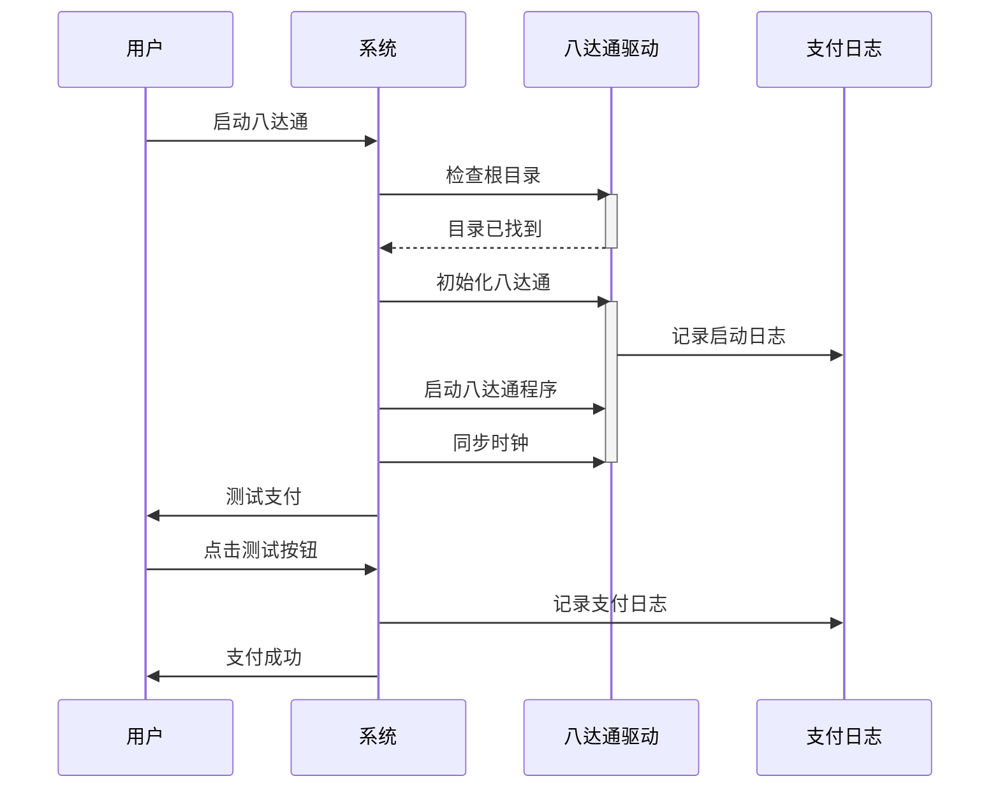

```mermaid
sequenceDiagram
    participant 用户
    participant 系统
    participant 八达通驱动
    participant 支付日志

    用户->>系统: 启动八达通
    系统->>八达通驱动: 检查根目录
    activate 八达通驱动
    八达通驱动-->>系统: 目录已找到
    deactivate 八达通驱动
    系统->>八达通驱动: 初始化八达通
    activate 八达通驱动
    八达通驱动->>支付日志: 记录启动日志
    系统->>八达通驱动: 启动八达通程序
    系统->>八达通驱动: 同步时钟
    deactivate 八达通驱动
    系统->>用户: 测试支付
    用户->>系统: 点击测试按钮
    系统->>支付日志: 记录支付日志
    系统->>用户: 支付成功
```